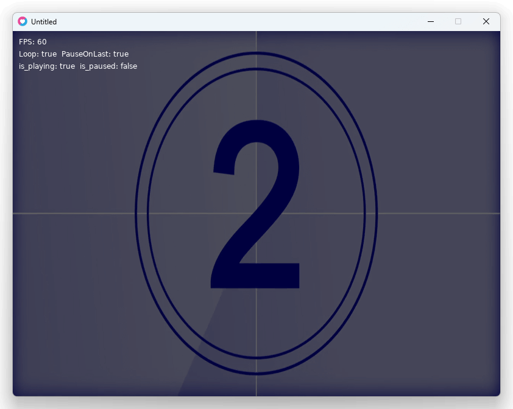

# LÖVE GV video player 

[gv-video](https://github.com/Ushio/ofxExtremeGpuVideo#binary-file-format-gv) player for [LÖVE](https://www.love2d.org/) (Love2D)



(gv-video is a kind of like HAP codec, GPU friendly extreme fast CPU decodable codec, with alpha channel support.)

## Note

- `src` and `test`, `lz4` is only needed if you build by yourself.
  - You just need `.lua` and `.dll`/`.dylib`/`.so` for production and game development.
- For encoding GVs, please use [my forked releases (tools)](https://github.com/funatsufumiya/ofxExtremeGpuVideo/releases/tag/1.1.2).

## Demo

```bash
$ git submodule update --init --recursive
$ love --console test/lua/test_gv_love2d_decode/

# Linux (Ubuntu)
$ LD_LIBRARY_PATH=. love --console test/lua/test_gv_love2d_decode

# Mac (if you have error when loading dylib)
$ DYLD_LIBRARY_PATH=. love --console test/lua/test_gv_love2d_decode
```

## Build dynamic library (only if you need)

```bash
$ git submodule update --init --recursive
$ cmake -B build
$ cmake --build build --parallel 8 -j 8 --config Release
$ cp build\Release\gv_video_decoder.dll .
```
